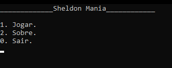
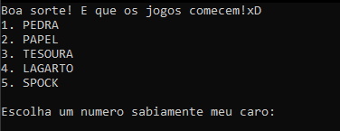

# 🖖 Sheldon Mania


> "Pedra, Papel, Tesoura, Lagarto, Spock!"

## 📖 Sobre o Projeto

**Sheldon Mania** é uma implementação em C do famoso jogo **Pedra-Papel-Tesoura-Lagarto-Spock**, popularizado pelo personagem Sheldon Cooper na série de TV *The Big Bang Theory*.

Este projeto foi desenvolvido como uma forma divertida de praticar lógica de programação e estruturas condicionais em C, trazendo uma variação mais complexa e estratégica do clássico Jokenpô.

---

## 🎮 Como Funciona

O jogo é uma expansão do clássico "Pedra, Papel e Tesoura", adicionando duas novas variáveis: **Lagarto** e **Spock**. Isso reduz as chances de empate e aumenta a complexidade das combinações.

### Regras do Jogo

As regras de vitória são as seguintes:

| Vencedor | Ação | Perdedor |
| :---: | :---: | :---: |
| **Tesoura** ✂️ | Corta | Papel 📄 |
| **Papel** 📄 | Cobre | Pedra 🪨 |
| **Pedra** 🪨 | Esmaga | Lagarto 🦎 |
| **Lagarto** 🦎 | Envenena | Spock 🖖 |
| **Spock** 🖖 | Esmaga | Tesoura ✂️ |
| **Tesoura** ✂️ | Decapita | Lagarto 🦎 |
| **Lagarto** 🦎 | Come | Papel 📄 |
| **Papel** 📄 | Refuta | Spock 🖖 |
| **Spock** 🖖 | Vaporiza | Pedra 🪨 |
| **Pedra** 🪨 | Quebra | Tesoura ✂️ |

---

## 🖥️ Interface do Jogo

### Menu Principal
Ao iniciar o jogo, você verá o menu principal onde pode escolher entre jogar, ver as regras ou sair.



### Jogando contra o Computador
Escolha sua jogada e veja se você consegue vencer a máquina!



### Resultado
O jogo mostra quem ganhou a rodada e pergunta se você deseja jogar novamente.


---

## 🚀 Como Executar

Para rodar este jogo em sua máquina, você precisará de um compilador C (como o GCC).

1. **Clone o repositório:**
   ```bash
   git clone https://github.com/marcos4lex/sheldon-mania.git
   cd sheldon-mania
   ```

2. **Compile o código:**
   ```bash
   gcc main.c -o sheldon-mania
   ```

3. **Execute o jogo:**
   ```bash
   ./sheldon-mania
   ```

---